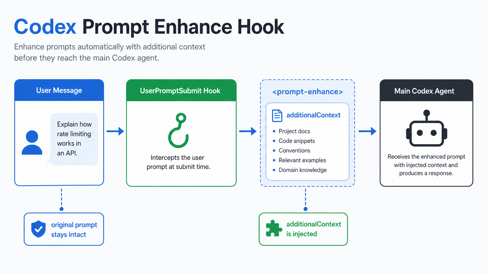
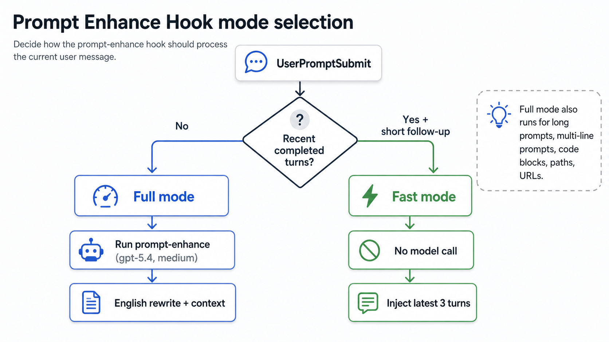
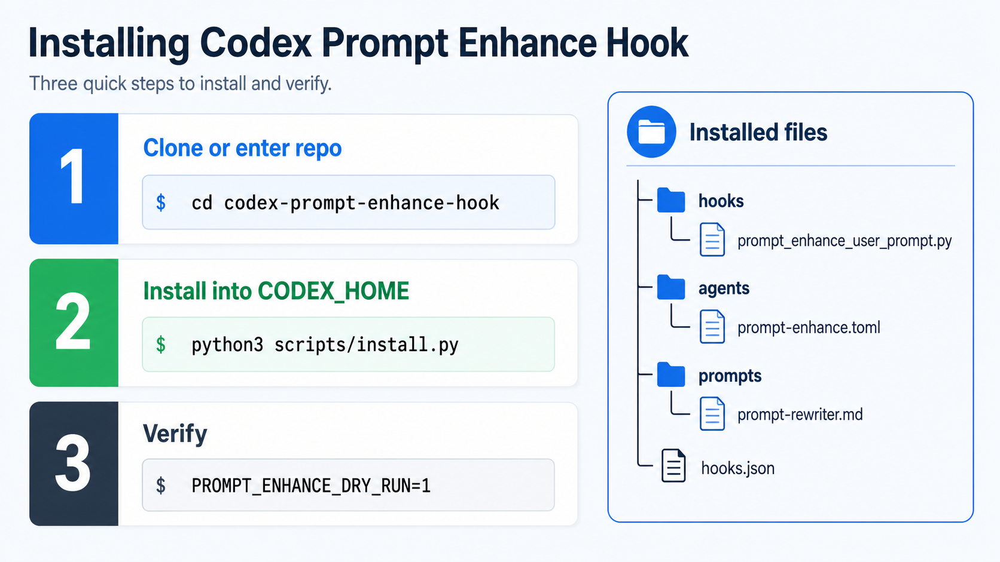
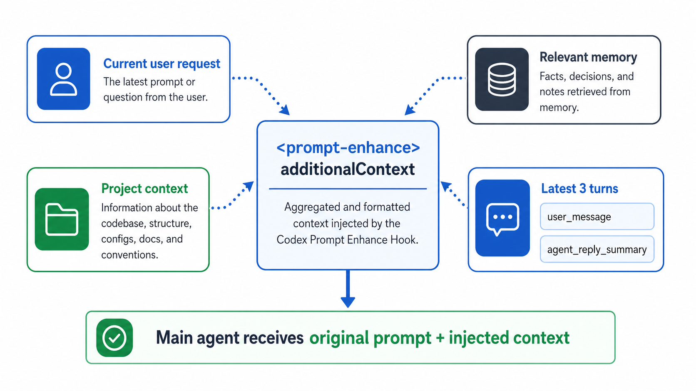

# Codex Prompt Enhance Hook

A `UserPromptSubmit` hook for Codex. It enriches each incoming user message before the main Codex agent handles it.

The hook adds a `<prompt-enhance>` context block with:

- a rewritten English version of the current user request when the full enhancer runs;
- project context such as current working directory, Git root, branch, status, and nearby project docs;
- relevant local memory lines from Codex memory files;
- recent session continuity from the last 3 completed user/assistant turns.

It is designed to be safe for open-source use. No API keys, private endpoints, or machine-specific paths are included.

## Visual Usage Guide

See [docs/usage-visual-guide.md](docs/usage-visual-guide.md) for the full visual walkthrough.

<table>
  <tr>
    <td width="50%">
      <a href="docs/usage-visual-guide.md#hook-flow">
        
      </a>
      <br>
      <strong>Hook flow</strong>
      <br>
      User message, hook, injected context, and main agent.
    </td>
    <td width="50%">
      <a href="docs/usage-visual-guide.md#mode-selection">
        
      </a>
      <br>
      <strong>Mode selection</strong>
      <br>
      Full mode for richer prompts, fast mode for short follow-ups.
    </td>
  </tr>
  <tr>
    <td width="50%">
      <a href="docs/usage-visual-guide.md#install-and-verify">
        
      </a>
      <br>
      <strong>Install and verify</strong>
      <br>
      Install files, run tests, and dry-run the hook.
    </td>
    <td width="50%">
      <a href="docs/usage-visual-guide.md#injected-context">
        
      </a>
      <br>
      <strong>Injected context</strong>
      <br>
      Current request, project facts, memory, and latest 3 turns.
    </td>
  </tr>
</table>

## Behavior

The hook has two modes.

`full` mode runs a lightweight Codex sub-process using model `gpt-5.4` and reasoning effort `medium`. This happens when:

- the session has no completed user/assistant turns;
- the current prompt is long;
- the current prompt is multi-line;
- the current prompt contains a code block;
- the current prompt contains a concrete path or URL;
- `PROMPT_ENHANCE_FORCE_FULL=1` is set.

`fast-session-context` mode does not call a model. It returns immediately when:

- the transcript has completed session turns;
- the current prompt is a short single-line follow-up.

In fast mode the hook injects the current user message plus the latest 3 completed session turns. Each turn contains:

- `user_message`
- `agent_reply_summary`

## Install

From this repository:

```bash
python3 scripts/install.py
```

By default it installs into `$CODEX_HOME`, or `~/.codex` if `CODEX_HOME` is not set.

You can install elsewhere:

```bash
python3 scripts/install.py --codex-home /path/to/.codex
```

The installer writes:

- `hooks/prompt_enhance_user_prompt.py`
- `agents/prompt-enhance.toml`
- `prompts/prompt-rewriter.md`
- a merged `hooks.json` entry for `UserPromptSubmit`

Existing `hooks.json` content is preserved and backed up before writing.

## Verify

Run the local tests:

```bash
python3 -m unittest discover -s tests
```

Run a hook dry run without a transcript. It should choose full mode:

```bash
printf '%s' '{"hook_event_name":"UserPromptSubmit","prompt":"new task","cwd":"'"$PWD"'"}' \
  | PROMPT_ENHANCE_DRY_RUN=1 python3 hooks/prompt_enhance_user_prompt.py
```

Run a dry run with a transcript path from Codex. A short follow-up should choose fast mode when the transcript has completed user/assistant turns:

```bash
printf '%s' '{"hook_event_name":"UserPromptSubmit","prompt":"continue","cwd":"'"$PWD"'","transcript_path":"/path/to/rollout.jsonl"}' \
  | PROMPT_ENHANCE_DRY_RUN=1 python3 hooks/prompt_enhance_user_prompt.py
```

## Configuration

Environment variables:

- `CODEX_HOME`: Codex config directory. Defaults to `~/.codex`.
- `PROMPT_ENHANCE_MODEL`: model used for full mode. Defaults to `gpt-5.4`.
- `PROMPT_ENHANCE_REASONING`: reasoning effort used for full mode. Defaults to `medium`.
- `PROMPT_ENHANCE_TIMEOUT_SECONDS`: timeout for full mode. Defaults to `120`.
- `PROMPT_ENHANCE_RULES`: prompt rewriting rules file. Defaults to `$CODEX_HOME/prompts/prompt-rewriter.md`.
- `PROMPT_ENHANCE_FORCE_FULL=1`: always use full mode.
- `PROMPT_ENHANCE_DRY_RUN=1`: do not call Codex; print the context that would be used.

## Codex Agent

The installed agent file is `agents/prompt-enhance.toml`. It uses:

- `name = "prompt-enhance"`
- `model = "gpt-5.4"`
- `model_reasoning_effort = "medium"`
- `sandbox_mode = "read-only"`

If your Codex setup uses an agent registry, add an entry similar to:

```toml
[agents."prompt-enhance"]
path = "/path/to/.codex/agents/prompt-enhance.toml"
model_profile = "prompt_enhance_secondary"
reasoning_profile = "medium"
description = "Rewrite incoming user prompts into clear execution context before the main agent sees them."
```

## Notes

`UserPromptSubmit` can add `hookSpecificOutput.additionalContext` before the main agent receives the user message. It does not replace the original user message. The main agent sees the original prompt plus this extra context block.
